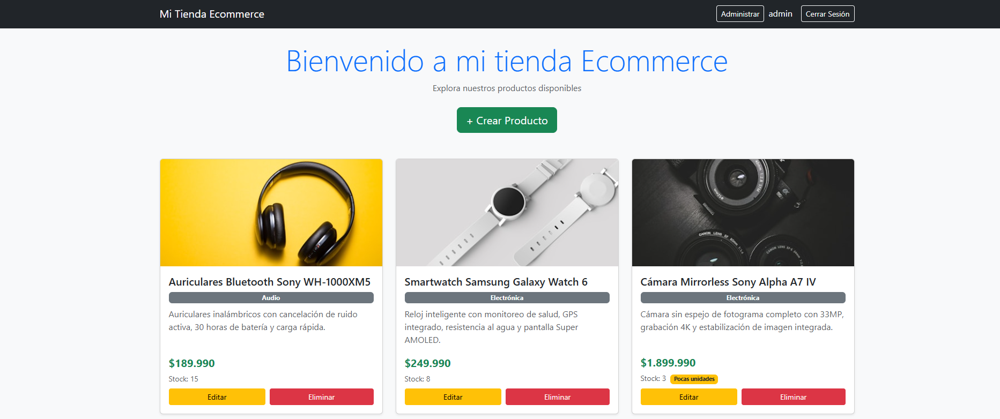
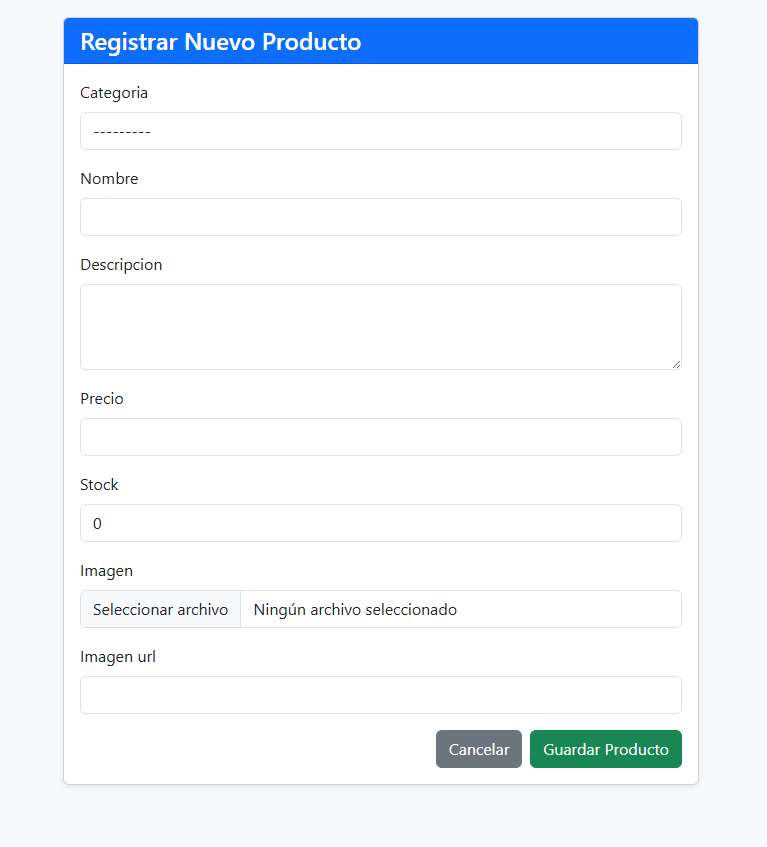
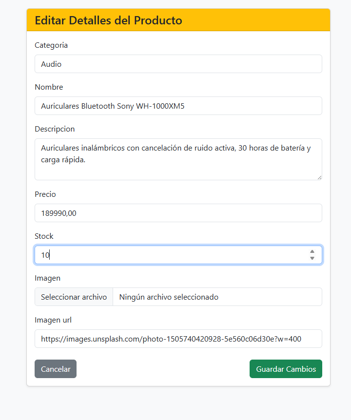
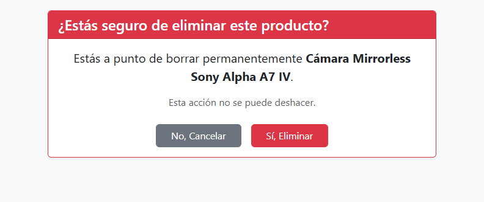

# Lección Final Módulo 7 - E-commerce con Django

Sistema de administración de catálogo de productos desarrollado en **Django 6.0** con Bootstrap 5. Incluye operaciones CRUD completas, autenticación de administradores, subida de imágenes y base de datos PostgreSQL.

> **⚠️ IMPORTANTE:** Para visualizar los botones de CRUD (Crear, Editar, Eliminar) es necesario **iniciar sesión** como administrador. Los usuarios anónimos solo ven el listado de productos en cards.

---

## Credenciales de Administrador

| Campo | Valor |
|---|---|
| **Usuario** | `admin` |
| **Contraseña** | `holamundo` |

Accede a `/accounts/login/` para iniciar sesión.

---

## Motor de Base de Datos

**PostgreSQL 15** corriendo en un contenedor Docker. Configuración en `docker-compose.yml`:

| Parámetro | Valor |
|---|---|
| Motor | `django.db.backends.postgresql` |
| Base de datos | `mi_django_db` |
| Usuario | `mi_usuario` |
| Contraseña | `mi_contraseña_secreta` |
| Puerto | `5432` |

---

## Descripción del Modelo de Datos

### `Producto` — `productos/models.py`

| Campo | Tipo | Restricciones | Descripción |
|---|---|---|---|
### `Producto` — `productos/models.py`

| Campo | Tipo | Restricciones | Descripción |
|---|---|---|---|
| `id` | `BigAutoField` | PK, auto | Identificador único |
| `categoria` | `ForeignKey(Categoria)` | null=True, on_delete=SET_NULL | Relación muchos-a-uno con Categoria |
| `nombre` | `CharField` | max_length=100, obligatorio | Nombre del producto |
| `descripcion` | `TextField` | blank=True | Descripción del producto |
| `precio` | `DecimalField` | max_digits=10, decimal_places=2, > 0 | Precio en pesos chilenos |
| `stock` | `IntegerField` | default=0 | Unidades disponibles |
| `imagen` | `ImageField` | upload_to="productos/", blank=True, null=True | Imagen subida desde el PC |
| `imagen_url` | `URLField` | blank=True | Imagen desde URL externa (demo) |

### `Categoria` — `productos/models.py`

| Campo | Tipo | Restricciones | Descripción |
|---|---|---|---|
| `id` | `BigAutoField` | PK, auto | Identificador único |
| `nombre` | `CharField` | max_length=50, obligatorio | Nombre de la categoría |

**Relaciones:** Un `Categoria` tiene muchos `Producto` (one-to-many vía `ForeignKey`).

**Validaciones:**
- `precio` debe ser mayor a 0 (validación en `ProductoForm.clean_precio`)
- `nombre` es obligatorio
- Si no se provee imagen, se muestra un placeholder

---

## Rutas del Módulo de Administración

### Públicas (sin autenticación)

| Ruta | Vista | Descripción |
|---|---|---|
| `GET /products/` | `inicio` | Página principal con productos en cards |
| `GET /accounts/login/` | Django Auth | Formulario de inicio de sesión |

### Protegidas (requiere admin)

| Ruta | Vista | Descripción |
|---|---|---|
| `GET/POST /products/list/` | `lista_productos` | Tabla administrativa de productos |
| `GET/POST /products/create/` | `crear_producto` | Formulario de creación |
| `GET/POST /products/edit/<id>/` | `actualizar_producto` | Formulario de edición |
| `GET/POST /products/delete/<id>/` | `eliminar_producto` | Confirmación y eliminación |
| `GET /products/logout/` | Django Auth | Cerrar sesión |
| `GET /admin/` | Django Admin | Panel administrativo de Django |

---

## Pasos para Ejecutar el Proyecto

### Requisitos previos

- Python 3.12+
- Docker y Docker Compose (para PostgreSQL)

### 1. Clonar el repositorio

```bash
git clone <URL_DEL_REPOSITORIO>
cd Leccion-Final-Modulo-7
```

### 2. Crear y activar entorno virtual

```bash
python -m venv venv

# Linux / macOS
source venv/bin/activate

# Windows
venv\Scripts\activate
```

### 3. Instalar dependencias

```bash
pip install -r requirements.txt
```

### 4. Levantar la base de datos (PostgreSQL con Docker)

```bash
docker compose up -d db
```

Esto inicia PostgreSQL en el puerto `5432` con las credenciales configuradas.

### 5. Ejecutar migraciones

```bash
python manage.py migrate
```

### 6. Crear superusuario (admin)

```bash
python manage.py createsuperuser
```

Sigue las instrucciones interactivas. También puedes usar:
```bash
DJANGO_SUPERUSER_PASSWORD="holamundo" python manage.py createsuperuser --username=admin --email=admin@example.com --noinput
```

### 7. Iniciar servidor de desarrollo

```bash
python manage.py runserver
```

### 8. Acceder a la aplicación

- **Tienda pública:** http://localhost:8000/products/
- **Login admin:** http://localhost:8000/accounts/login/
- **Panel Django admin:** http://localhost:8000/admin/

> Los productos de demostración se crean automáticamente al cargar `/products/` si la base de datos está vacía.

---

## Evidencias

### Listado de productos (vista pública)

Al ingresar a `/products/` se muestran los productos en cards con imagen, nombre, precio y stock. Sin iniciar sesión solo se visualiza el catálogo.

### Formulario de creación

Accesible en `/products/create/` (requiere login como admin). Formulario alineado con Bootstrap que incluye: nombre, descripción, precio, stock, imagen (archivo) e imagen URL.

### Formulario de edición

Accesible en `/products/edit/<id>/`. Misma estructura que el formulario de creación pero precargado con los datos del producto existente.

### Confirmación de eliminación

Al hacer clic en "Eliminar" se muestra una página de confirmación antes de borrar definitivamente el producto.

---

## Capturas de pantalla

### Listado de productos (vista pública)



### Formulario de creación



### Formulario de edición



### Confirmación de eliminación



---

## Estructura del Proyecto

```
├── conf/                   # Configuración del proyecto Django
│   ├── settings.py
│   ├── urls.py
│   └── wsgi.py
├── productos/              # Aplicación principal
│   ├── models.py           # Modelo Producto
│   ├── views.py            # Vistas CRUD + seed
│   ├── forms.py            # Formulario con validaciones
│   ├── urls.py             # Rutas de la aplicación
│   ├── admin.py            # Registro en admin Django
│   ├── templatetags/
│   │   └── producto_extras.py  # Filtro clp (formato precios)
│   └── templates/
│       ├── base.html
│       ├── inicio.html
│       ├── lista_productos.html
│       ├── crear_producto.html
│       ├── actualizar_producto.html
│       ├── confirmar_eliminacion.html
│       └── registration/
│           └── login.html
├── media/                  # Archivos subidos (imágenes)
├── docker-compose.yml      # PostgreSQL + pgAdmin
├── Dockerfile
├── manage.py
└── requirements.txt
```
